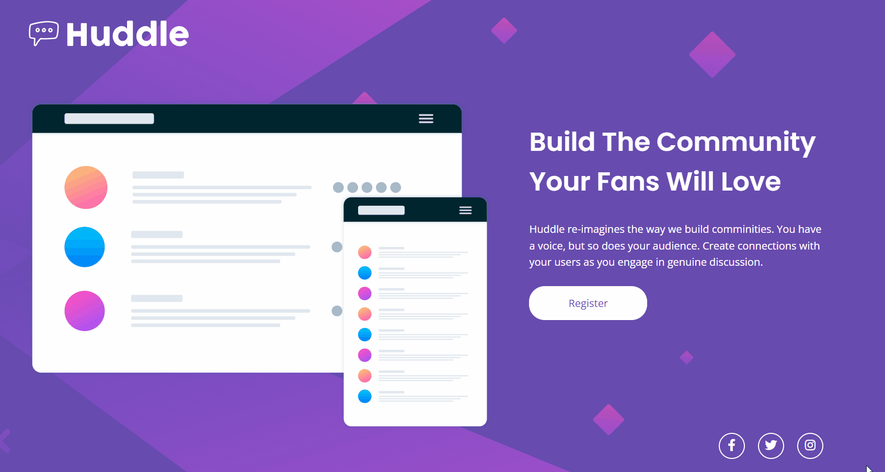

# Projeto Frontend Mentor - Huddle landing page 

Este é um projeto de landing page baseado em um desafio do Frontend Mentor. 

[] (https://github.com/Geicimara-nunes/quest-huddle.git)

## O Projeto

Uma página landing page com design responsivo e alteração de estilo de elementos com hover.

[]

 []

### Linguagens utilizadas 

- HTML

- CSS

